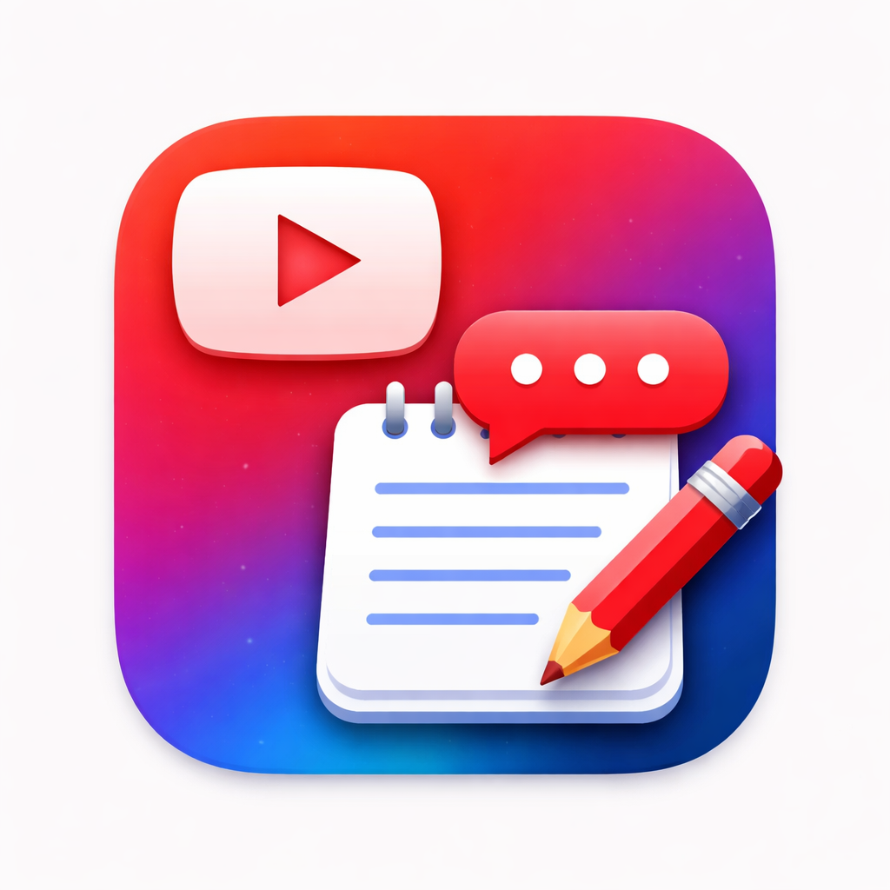
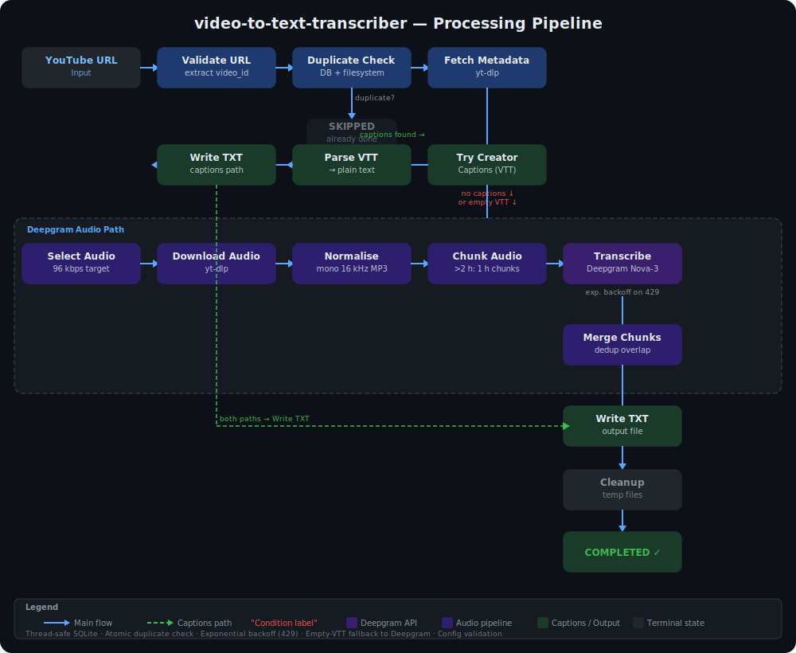

# video-to-text-transcriber

<p align="center">
  
</p>

<p align="center">
  <strong>A native macOS desktop application for transcribing *Tube videos.</strong><br/>
  Built with <strong>PyInstaller</strong> into a genuine <code>.app</code> bundle — double-click to launch from Finder, Spotlight, or the Dock. No terminal required.
</p>

<p align="center">
  
  
  
  
</p>

---

Takes a **captions-first approach**: it downloads creator-provided English captions whenever available, falling back to **Deepgram Nova-3** speech-to-text only when captions are absent. The result is fast, accurate transcripts saved as plain text files on your Mac.

## Pipeline Overview



## Features

Designed as a single-user, offline-first macOS application with no server component and no incoming network connections.

| Category | Details |
|----------|---------|
| **Native macOS app** | Real Mach-O binary, launches from Finder/Spotlight/Dock |
| **Self-contained** | Bundles Python and all dependencies via PyInstaller |
| **Captions-first** | Uses creator-provided English captions when available |
| **Deepgram fallback** | Nova-3 speech-to-text for videos without captions; falls back automatically if captions parse empty |
| **Batch processing** | Paste multiple URLs or load `.txt`/`.csv` files |
| **Duplicate detection** | Atomic check — skips videos already transcribed |
| **Auto-retry** | Retries transient failures; manual retry/remove from UI |
| **Adaptive chunking** | Splits long audio on Deepgram timeouts automatically |
| **Rate-limit handling** | Exponential backoff (up to 4 retries) on Deepgram 429 responses |
| **Security hardened** | No listening ports, path traversal protection, Keychain storage |
| **Inline API key** | Change your Deepgram key directly in the Settings tab — no popup dialog |
| **Cookies export** | Chrome extension for age-restricted or login-required videos |

## Requirements

### System

Requires **macOS 10.15 or later** and runs on both Intel and Apple Silicon Macs. Python 3.10 or newer is needed only for building the app — the built `.app` is fully self-contained.

### External Tools

Two command-line tools must be installed via Homebrew. These are used at runtime for downloading and processing audio:

```bash
brew install yt-dlp ffmpeg
```

### Deepgram API Key

A Deepgram API key is required for the speech-to-text fallback (used only when creator captions are unavailable). Sign up at [deepgram.com](https://deepgram.com) to obtain a key. The key is stored securely in the **macOS Keychain** and never written to disk in plaintext.

## Quick Start

### 1. Clone and Build

```bash
git clone https://github.com/llmspace/video-to-text-transcriber.git
cd video-to-text-transcriber
pip3 install -r requirements.txt
./build.sh
```

The build script checks that Python 3, PyInstaller, and requests are available, then produces a native `.app` bundle at `dist/VideoToTextTranscriber.app` with quarantine flags automatically removed.

### 2. Install

```bash
./install.sh
```

This copies the built app to `/Applications` and verifies that `yt-dlp` and `ffmpeg` are installed.

### 3. Launch

Launch through any standard macOS method: open **Finder** and navigate to Applications, use **Spotlight** and type "Video to Text", or drag the app to the **Dock** for quick access. No terminal window is needed — the app runs as a native GUI application.

## Usage

### Adding Videos

The main window presents a drop zone where you can paste YouTube URLs (one per line) or click **Load File** to select a `.txt` or `.csv` file containing URLs. Click **Start** to begin processing the queue.

### Output

Transcripts are saved as plain text files organized by video title:

```
~/Downloads/Video Transcripts/
  └── Video Title/
      └── dQw4w9WgXcQ.txt
```

### Processing Pipeline

Each video passes through the following stages in sequence. The job state machine tracks progress through QUEUED, RUNNING, and terminal states (COMPLETED, FAILED, or SKIPPED).

| Stage | Description |
|-------|-------------|
| **Validate URL** | Extract `video_id` from the YouTube URL |
| **Check duplicates** | Atomic DB check — skip if the video has already been transcribed |
| **Fetch metadata** | Retrieve title, duration, and available formats via yt-dlp |
| **Try creator captions** | Download creator-provided English captions in VTT format |
| **Parse VTT** | Convert VTT to clean plain text; falls back to Deepgram if empty |
| **Deepgram fallback** | If no captions: select audio stream, download, normalize, chunk, transcribe |
| **Merge chunks** | Combine transcript segments with overlap deduplication |
| **Write output** | Save the final transcript to the output directory |
| **Cleanup** | Delete temporary audio artifacts |

### Audio Pipeline (Deepgram Path)

When creator captions are unavailable, the app downloads and processes audio before sending it to Deepgram. The audio stream is selected targeting 96 kbps (accepting 64–128 kbps), then normalized to mono 16 kHz MP3 at 96 kbps using ffmpeg. Videos longer than two hours are split into overlapping chunks to stay within Deepgram's processing limits.

If Deepgram returns a 429 rate-limit response, the app retries automatically with exponential backoff (2s, 4s, 8s, 16s) before failing.

## Browser Extension (Cookies Export)

For age-restricted or login-required videos, a Chrome extension is included that exports YouTube-only cookies in Netscape format:

1. Open Chrome and navigate to `chrome://extensions/`
2. Enable **Developer mode** in the top-right corner
3. Click **Load unpacked** and select the `app/extension/` directory
4. Log in to YouTube, then click the extension icon and select **Export Cookies**
5. In the app's Settings tab, set Cookies mode to **Use cookies.txt file**

The extension only exports cookies scoped to `youtube.com` domains and never transmits data externally.

## Settings

The Settings tab provides configuration for output location, cookies, debug mode, and the Deepgram API key.

| Setting | Default | Description |
|---------|---------|-------------|
| Output folder | `~/Downloads/Video Transcripts/` | Directory where transcripts are saved |
| Cookies mode | Off | Enable to use an exported cookies.txt file for restricted content |
| Keep debug artifacts | Off | Preserve metadata JSON and Deepgram response files after jobs |
| Deepgram API key | *(Keychain)* | Enter and save directly in the Settings tab — stored securely in macOS Keychain |

### Changing Your API Key

The Settings tab contains an inline API key field. Paste your key, click **Save Key**, and the app verifies it with Deepgram before storing it in Keychain. A Show/Hide toggle lets you view the key while typing. No separate dialog is required.

## Logs and Troubleshooting

### Log Location

Application logs are written to `~/Library/Logs/video-to-text-transcriber/app.log` and include timestamped entries for every pipeline stage, tool paths, and full error details (up to 2000 characters per error).

### Common Issues

| Issue | Solution |
|-------|----------|
| Build fails with "PyInstaller not found" | Run `pip3 install pyinstaller` |
| "Missing required tools" alert on launch | Run `brew install yt-dlp ffmpeg` and rebuild the app |
| App can't find yt-dlp/ffmpeg after install | Rebuild with `./build.sh` — the app adds Homebrew paths to PATH at startup |
| Transcription timeout on long videos | Handled automatically — the app splits audio into smaller chunks and retries |
| "Restricted content" error | Export cookies using the included browser extension |
| Gatekeeper blocks the app | Run `xattr -cr dist/VideoToTextTranscriber.app` or right-click → Open |
| Deepgram 429 rate limit errors | App retries automatically with exponential backoff (up to 4 attempts) |

### PATH Handling

When macOS launches a `.app` bundle, it does not source shell profiles (`~/.zshrc`, `~/.bash_profile`), so Homebrew paths are not available by default. The application automatically adds `/opt/homebrew/bin`, `/usr/local/bin`, and common Python framework paths to `PATH` at startup, ensuring that `yt-dlp` and `ffmpeg` are found regardless of how the app is launched.

## Uninstall

```bash
./uninstall.sh
```

This removes the app from `/Applications` and optionally deletes application support data. Transcripts in the output directory are never deleted.

## Architecture

```
video-to-text-transcriber/
├── main.py                         ← Python entry point (PATH setup, prereq checks)
├── VideoToTextTranscriber.spec     ← PyInstaller build configuration
├── build.sh                        ← Build script (runs PyInstaller)
├── install.sh                      ← Install to /Applications
├── uninstall.sh                    ← Clean uninstaller
├── requirements.txt                ← Python dependencies
├── app/
│   ├── desktop/                    ← UI layer (tkinter)
│   │   ├── ui_main.py             ← Main window, tabs, event handling
│   │   ├── ui_components.py       ← Reusable widgets (DropZone, JobsList)
│   │   └── ui_settings.py         ← Settings panel with inline API key entry
│   ├── core/                       ← Business logic
│   │   ├── constants.py           ← Shared configuration values and version
│   │   ├── config.py              ← JSON config manager with input validation
│   │   ├── db_sqlite.py           ← Thread-safe SQLite database with explicit locks
│   │   ├── models_sqlite.py       ← Data models
│   │   ├── job_queue.py           ← Job worker and pipeline orchestration
│   │   ├── url_parse.py           ← YouTube URL validation and parsing
│   │   ├── yt_metadata.py         ← Video metadata fetching via yt-dlp
│   │   ├── captions_fetch.py      ← Creator caption downloading
│   │   ├── captions_parse.py      ← VTT to plain text conversion
│   │   ├── audio_select.py        ← Audio stream selection
│   │   ├── download_audio.py      ← Audio downloading via yt-dlp
│   │   ├── normalize.py           ← Audio normalization via ffmpeg
│   │   ├── chunking_timebased.py  ← Time-based audio chunking
│   │   ├── transcribe_deepgram.py ← Deepgram Nova-3 with exponential backoff
│   │   ├── merge.py               ← Transcript chunk merging with deduplication
│   │   ├── output_writer.py       ← Transcript file writing
│   │   ├── cleanup.py             ← Temporary file cleanup
│   │   ├── security_utils.py      ← Path sanitization, subprocess safety
│   │   ├── error_codes.py         ← Standardized error codes
│   │   └── diagnostics.py         ← System diagnostics
│   └── extension/                  ← Chrome extension for cookies export
│       ├── manifest.json
│       ├── background.js
│       ├── popup.html
│       ├── popup.js
│       └── README.md
├── tests/
│   └── test_core.py               ← Unit tests (43 tests)
└── dist/                           ← Built .app bundle (after ./build.sh)
    └── VideoToTextTranscriber.app
```

## Security

The application is designed with a strict security posture appropriate for a local desktop tool that handles API credentials and user content.

**No incoming connections** — the application never binds or listens on any TCP or UDP port. All network activity is outbound only (YouTube via yt-dlp, Deepgram API via HTTPS).

**Least-privilege filesystem access** — the app only reads and writes within the configured output directory, the Application Support folder, and the cookies file path. All output paths are validated with `realpath()` checks to prevent path traversal.

**Subprocess safety** — all calls to `yt-dlp` and `ffmpeg` use argument arrays with `shell=False`, preventing shell injection. No user input is ever interpolated into shell commands.

**Secrets in Keychain** — the Deepgram API key is stored in the macOS Keychain and retrieved at runtime. It is never written to configuration files, logged, or displayed in the UI after entry.

**Thread-safe database** — all SQLite write operations are guarded by a `threading.Lock()`, preventing race conditions between the worker thread and UI actions.

**Config validation** — all user-supplied configuration values (chunk thresholds, cookies mode) are validated and clamped to safe ranges before being persisted.

## Privacy

All processing happens locally on your Mac. Audio files are downloaded temporarily and deleted after transcription. The only outbound connections are to YouTube (via yt-dlp) and the Deepgram API (for speech-to-text when captions are unavailable). No data is sent to any other service.

## Changelog

### v1.0.0

- **Renamed** from YouTubeTranscriber / TranscriberV3 to `video-to-text-transcriber`
- **SQLite thread safety**: all write operations now use explicit `threading.Lock()` guards
- **Atomic duplicate detection**: duplicate check and status update happen in a single locked transaction
- **Deepgram rate limiting**: exponential backoff with jitter on 429 responses (up to 4 retries: 2s/4s/8s/16s)
- **Captions fallback**: if VTT captions parse to empty text, pipeline automatically falls back to Deepgram
- **Error messages**: increased truncation limit from 500 to 2000 characters for better debugging
- **Config validation**: `chunk_threshold_hours` and `base_chunk_sec` are validated and clamped to safe ranges; `cookies_mode` is validated against allowed values
- **Inline API key**: Deepgram key can now be entered, verified, and saved directly in the Settings tab without opening a dialog
- **Output folder**: moved from `~/Downloads/YouTube Transcripts/` to `~/Downloads/Video Transcripts/`
- **Logs**: moved to `~/Library/Logs/video-to-text-transcriber/app.log`

## Disclaimer

This tool is intended for **personal, educational, and accessibility use only**. Users are responsible for ensuring their use complies with any video platform's Terms of Service and applicable laws in their jurisdiction.

This tool does not host, redistribute, or monetize any video content. It uses `yt-dlp` (an open-source tool) to access publicly available content for the purpose of generating text transcripts. The application does not circumvent digital rights management (DRM) or technological protection measures.

**By using this software, you acknowledge that:**
- You will only transcribe content you have the right to access
- You are responsible for compliance with YouTube's Terms of Service
- The developers are not liable for any misuse of this tool

## License

MIT License. See [LICENSE](LICENSE) for details.
